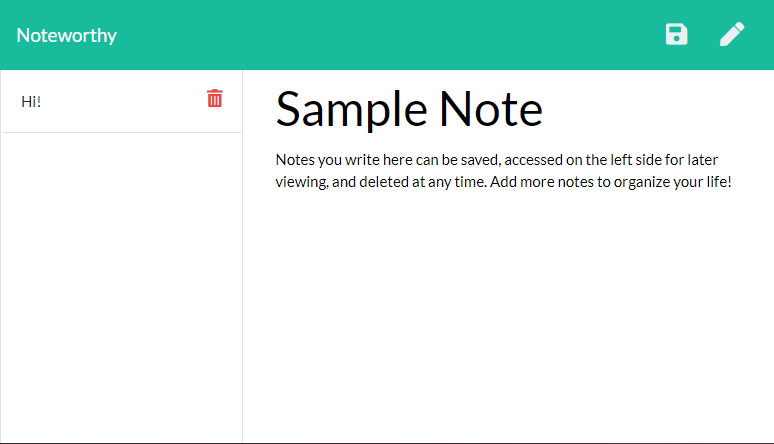

# Noteworthy
  
  

  ## Description
  This is a handy note-taking app that can be used to write, save, and delete notes. Using an Express backend, it saves and retrieves note data from a JSON file.

  Deployed at: https://noteworthy-note-app.herokuapp.com/

  Repository: https://github.com/LindseyM20/noteworthy

  ## Table of Contents
  * [**Installation**](#installation)
  * [**Usage**](#usage)
  * [**Contributing**](#contributing)
  * [**Tests**](#tests)
  * [**License**](#license)
  * [**Questions**](#questions)

  ## Installation
  Commands to run to install dependencies: npm install

  ## Usage
  Simply open this application in the browser. Your saved notes will persist when the page is refreshed or revisited later.

  

  ## Contributing
  Contact me

  ## Tests
  Command to run tests: N/A

  ## Support Team
  Special thanks to: 

  [Amanda Anderson](https://github.com/aanderson120)

  [Brooklynne Audette](https://github.com/B-Audette)

  [Dorotea Flores-Kestner](https://github.com/dfkestner)
  

  ## License
  The contents of this repository are protected under the Unlicense license

  ## Questions
  Follow me on GitHub at https://github.com/LindseyM20

  Please contact me with any questions or feedback at lindsey.bordner@gmail.com 
